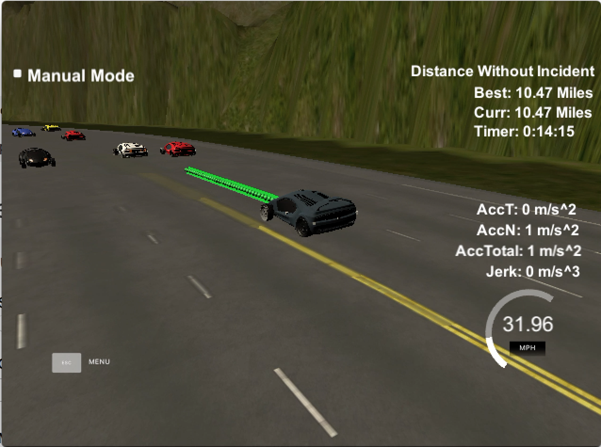

# Path-Planning-Project

In this project car is given a trajectory to drive around the track without colliding with other cars and staying within speed limit.

The goals of this project are the following:

 * safely navigate around a virtual highway with other traffic that is driving +-10 MPH of the 50 MPH speed limit
 * use car's localization, sensor fusion data and map list of waypoints around the highway  
 * having speed as close as possible to the 50 MPH speed limit, which means passing slower traffic when possible, note that other cars will try to change lanes too. 
 * The car should avoid hitting other cars at all cost as well as driving inside of the marked road lanes at all times, unless going from one lane to another. 
 * The car should be able to make one complete loop around the 6946m highway. Since the car is trying to go 50 MPH, it should take a little over 5 minutes to complete 1 loop. 
 * Also the car should not experience total acceleration over 10 m/s^2 and jerk that is greater than 50 m/s^3.




## Description

### Available Data

* Highway map: Each waypoint in the list contains  [x,y,s,dx,dy] values. x and y are the waypoint's map coordinate position, the s value is the distance along the road to get to that waypoint in meters, the dx and dy values define the unit normal vector pointing outward of the highway loop.
* Main car's localization Data (No Noise) [x, y, s, d, yaw, speed]. The x & y is car'sposition in map coordinates, s & d are cars' position in frenet coordinates, yaw is car's angle in the map, and finally the car's speed is in MPH.
* Sensor_fusion provides 2d vector of cars and then that car's with [unique ID, x, y ,vx, vy, s,d]
* Previous Path: ["previous_path_x"] & ["previous_path_y"] are the list of x & y points previously given to the simulator


### Approach

* For each frame, I process 3 previous (x,y) points of my car to generate my current acceleration and starting point of the trajectory: s_dot, d_dot , s_dot_dot & d_dot_dot. (using ["previous_path_x"] & ["previous_path_y"])
* For having a good estimate of my car's surrounding, I generate a prediction list of each cars' frenet coordinate (s,d) for next 5 frames (frame rate is 0.02 sec.) assuming that they each have a constant velocity. (using sensor_fusion data)
* Next step is deciding which state of state machine 3 states of "KL" as Keep Lane, "LCL" as Lane Change Left and "LCR" as Lane Change Right has the best trajectory (i.e. no collision, no jerk and low cost)
* Trajectory and path interpolating

### Behavioral Planner

* Based on ego vehicle's current state I evaluate available states considering their trajectory and cost.
* Each available state is assumed to be a target state with boundary trajectories of target[s,s_dot, s_dot_dot, d, d_dot, d_dot_dot] and the goal is to generate a continous trajectory from current state to target state with minimized trajectories of s and d using quintic polynomial, jerk-minimizing (JMT) trajectory, to estimate of the final trajectory based on the target state:
   * s(t) = a0+ a1t + a2t^2 + a3t^3 + a4t^4 + a5t^5
   * d(t) = b0+ b1t + b2t^2 + b3t^3 + b4t^4 + b5t^5
   
* Each trajectory cost is then evaluated to find the best option to transit from current state to:
   * collision cost: iterating through the estimated trajectory there should be no collision (minimum space 10m) between points and other cars' predictions 
   * speed cost: iterating through the estimated trajectory, none of the points should lead us to maximum speed limit, additionally speeds below 30mph are penalized relatively.
   * lane change cost: this cost is more complicated than the other ones such as checking for the car in the back as well as comparing a couple of metrics between current lane and the target lane:
      * if target_lane has a slower-moving leading_car than the leading_car in current_lane (reward/penalize accordingly)
      * if target_lane leading_car is relatively closer to target_s than the leading_car in current_lane (reward/penalize accordingly)
      * reward: if there's no leading car in the target_lane   
   
* More speed adjustment: even after estimating the target_s_dot we still need to keep jerk & total acceleration below 10m/s2, for this purpose I cache the most recent 50 speeds (5 intervals of 10 speeds) to sum up the speed change_rate on interval averages. If the total_acceleration exceeds the limit, I adjust the target_s_dot to balance acceleration.

* Finally building a smooth trajectory: for this step I use 2 previous points from the path to make the trajectory tanget to the car and add a couple of waypoints within 30m, 60m, 90m, 120m ahead of ego car, these points should be transformed to car's local coordinate and then I fit the points using Spline.h library. Since simulator gives us a lot of points from previous path we can keep them and add more x & y if necessary (in case we have less than 50 points from previous path), all points should be converted to global coordinate system.

* More hacks and fixes: 
  * to avoid car from changing lanes constantly in between lanes in less than 1 sec , I use counters to keep current lane for ~50 frames after any lane changes
  * ego car tends to act poorly on changing lanes when its speed is less than 20mph (from my experiments), I avoid lane chnging when car has not reached a certain speed
  * for changing lanes I have a separate counter to allow car to move to target lane before doing next evaluation process
  * to avoid max acceleration speed should only be incremented and decremented with very small values, which is not always possible to maintain becuase sometimes other cars just move to our lane and it's impossible to keep max acceleration below 10 and still not crash the other car.
  


## Dependencies

* cmake >= 3.5
 * All OSes: [click here for installation instructions](https://cmake.org/install/)
* make >= 4.1
  * Linux: make is installed by default on most Linux distros
  * Mac: [install Xcode command line tools to get make](https://developer.apple.com/xcode/features/)
  * Windows: [Click here for installation instructions](http://gnuwin32.sourceforge.net/packages/make.htm)
* gcc/g++ >= 5.4
  * Linux: gcc / g++ is installed by default on most Linux distros
  * Mac: same deal as make - [install Xcode command line tools]((https://developer.apple.com/xcode/features/)
  * Windows: recommend using [MinGW](http://www.mingw.org/)
* [uWebSockets](https://github.com/uWebSockets/uWebSockets)
  * Run either `install-mac.sh` or `install-ubuntu.sh`.
  * If you install from source, checkout to commit `e94b6e1`, i.e.
    ```
    git clone https://github.com/uWebSockets/uWebSockets 
    cd uWebSockets
    git checkout e94b6e1
    ```


